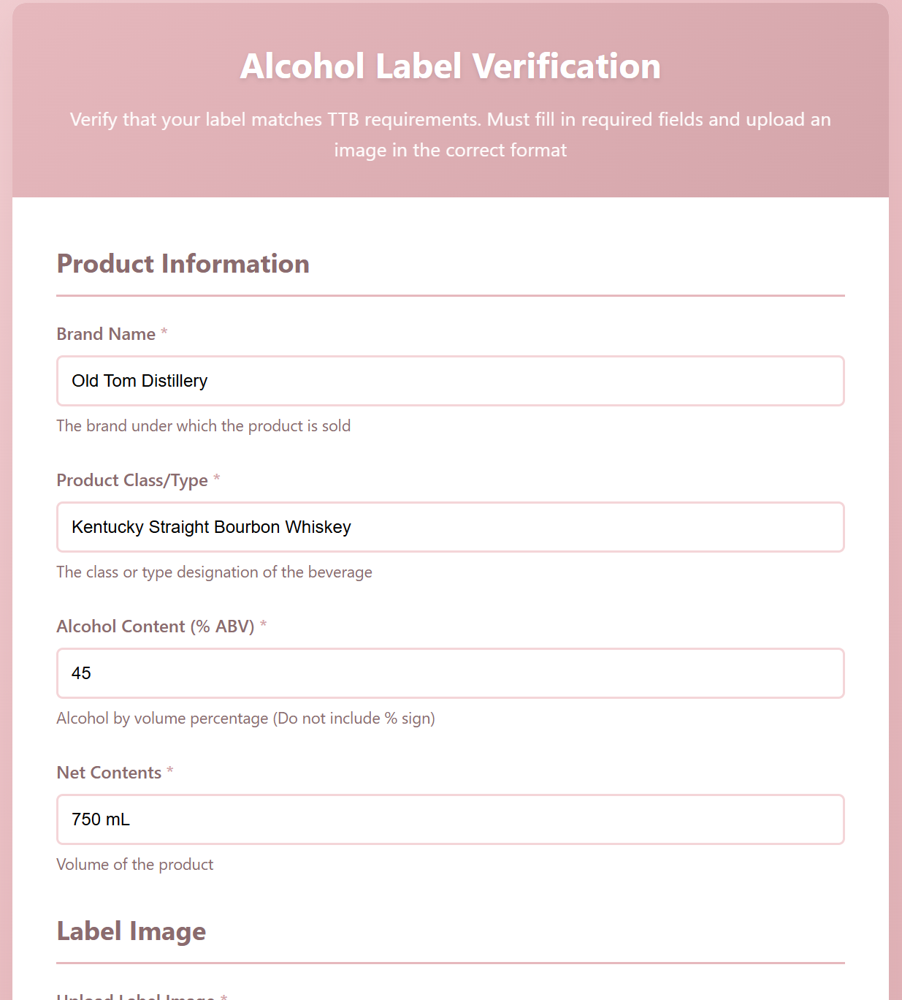
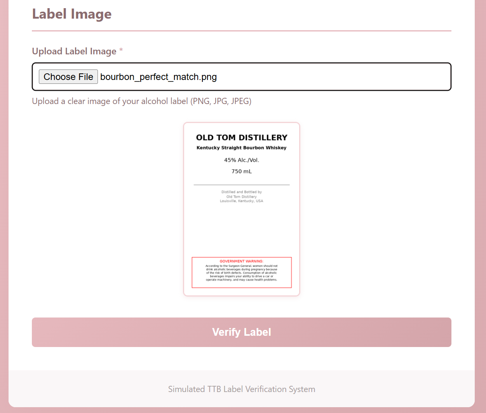
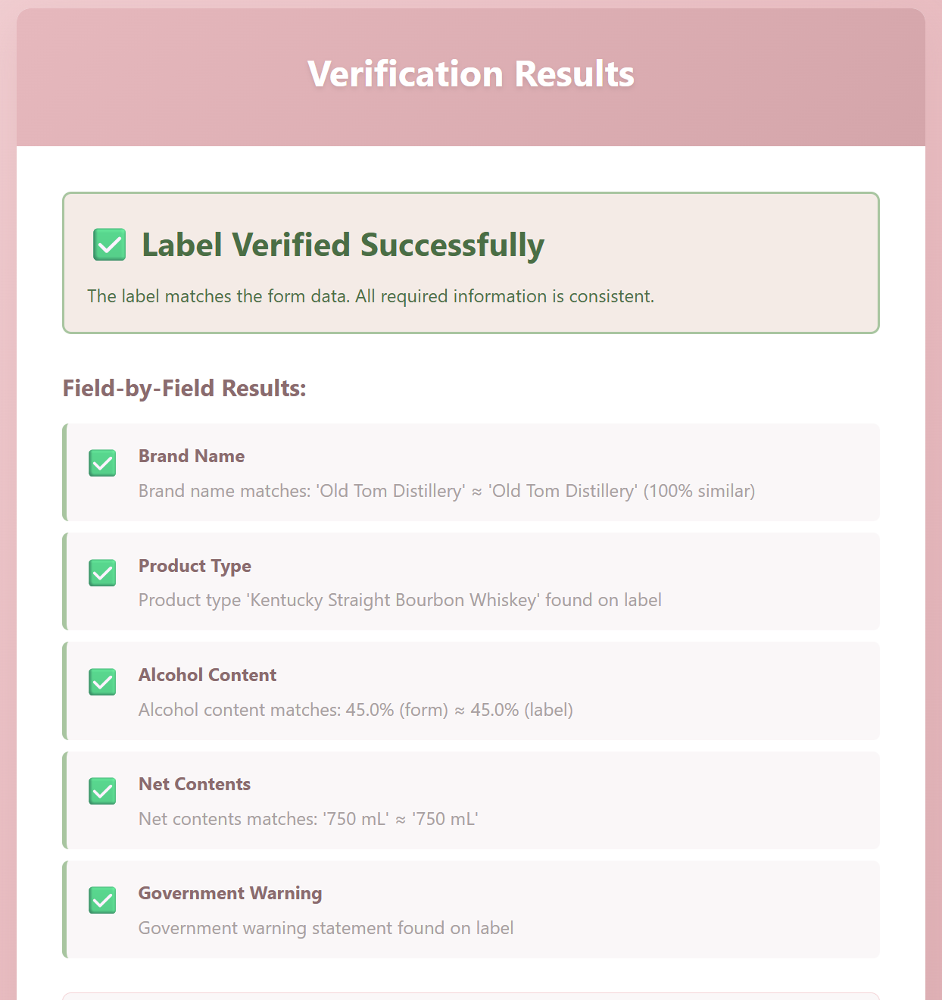
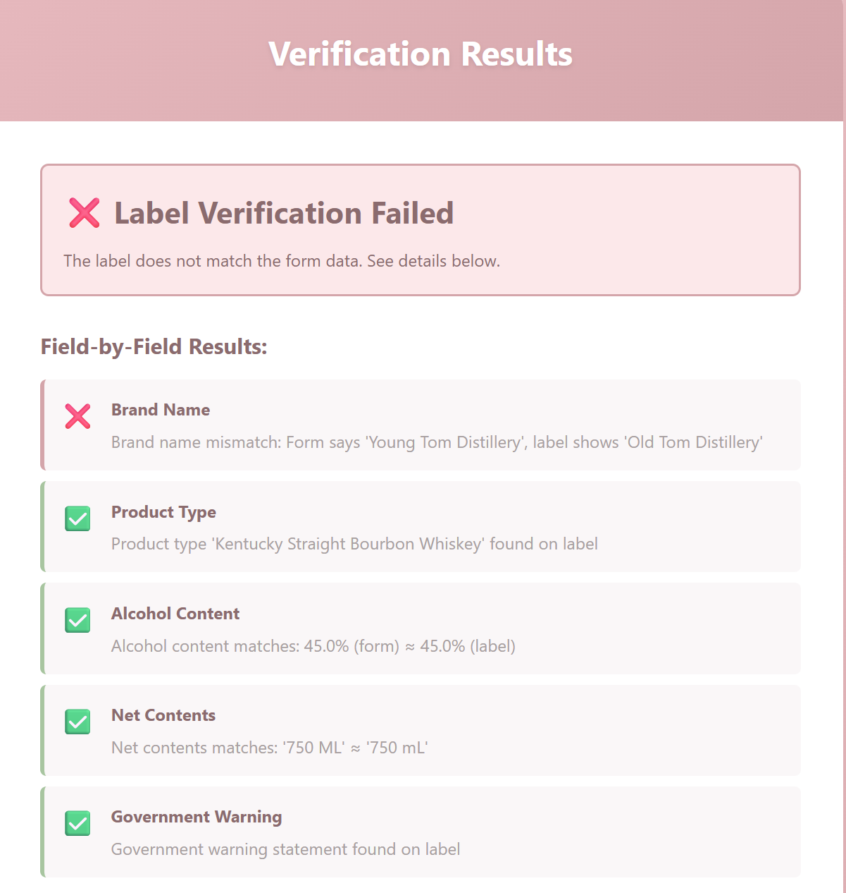
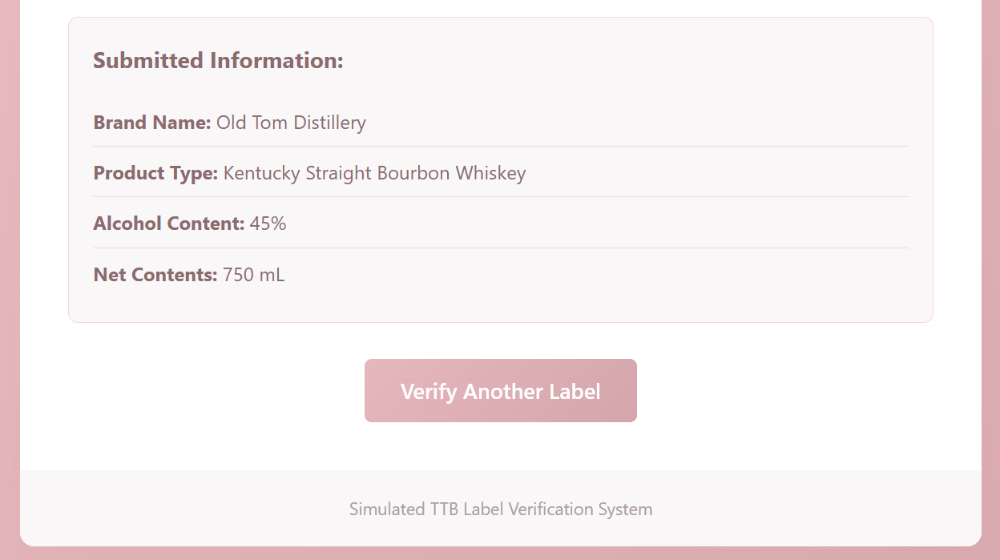

#  Alcohol Label Verification App

A web application that simulates the TTB (Alcohol and Tobacco Tax and Trade Bureau) label approval process. The app uses OCR technology to extract information from alcohol beverage labels and verifies that the label content matches the submitted application form.

## Live Demo

**Deployed Application:** https://alcohol-label-verifier-production.up.railway.app/

Click the link to try the application to see the OCR and validation in action!

**Note:** First request may take 30-60 seconds as the service starts up (free tier limitation).

### Try It Out with Test Images

Ready-to-use test images are available in the [`test_images/`](test_images/) folder.

**Quick Test:**
1. Browse to [`test_images/`](test_images/) in this repository
2. Download [`01_bourbon_perfect_match.png`](test_images/01_bourbon_perfect_match.png)
3. Go to the [live demo](https://alcohol-label-verifier-production.up.railway.app/)
4. Upload the image and enter:
```
   Brand Name: Old Tom Distillery
   Product Type: Kentucky Straight Bourbon Whiskey
   Alcohol Content: 45
   Net Contents: 750 mL
```
5. Click "Verify Label" and see all fields pass! 

**More test scenarios:** See [`testing_guide.md`](testing_guide.md) for complete test data and expected results.

##  Project Overview

This application was built as a take-home project for the Department of Treasury as a simple example of the types of problems we would be tackling in the Department. This was intended as a project to demonstrate full stack AI skills that can be applicable to various different projects in the future.

---

## Screenshots

### Application Interface

**Form with Image Preview**




*Upload an alcohol label image and fill in the required information fields. The app provides instant image preview.*

---

### Successful Verification



*When all fields match, the app displays a success indicator with green checkmarks and detailed confirmation messages!*

---

### Failed Verification



*When fields don't match, the app shows specific errors explaining what didn't match between the form and the label.*

---

### Submitted Info



*After each verification attempt,the info you submitted will be visible under the verification explanation.*

## Features

- **Image Upload & Preview**: Upload alcohol label images with instant preview
- **OCR Text Extraction**: Automatically extracts text from label images using Tesseract OCR
- **Smart Validation**: Compares extracted data against form inputs:
  - Brand name (fuzzy matching with 85% similarity threshold)
  - Product type/class (word-by-word matching)
  - Alcohol content (±0.3% tolerance)
  - Net contents/volume
  - Government warning statement presence
- **Detailed Results**: Clear feedback showing which fields match/mismatch and why
- **Error Handling**: Handling of invalid files, OCR failures, and edge cases

## Tech Stack

**Backend:**
- Python 3.10+
- Flask (Python web framework)
- Tesseract OCR (text extraction)
- Pillow (image processing)
- pytesseract (Python wrapper for Tesseract)

**Frontend:**
- HTML5/CSS3
- Vanilla JavaScript

**Deployment:**
- Docker containerization
- Railway platform
- Gunicorn WSGI server

## Installation

### Prerequisites

- Python 3.10 or higher
- Tesseract OCR

#### Install Tesseract:

For this README, the instruction will be for Linux distributions such as Ubuntu/ Debian. For MAC/ Windows, adjust accordingly.

```bash
sudo apt-get update
sudo apt-get install tesseract-ocr
```


### Setup Instructions

1. **Clone the repository:**
```bash
git clone https://github.com/seerreenna/alcohol-label-verifier
```

2. **Create and activate virtual environment:**
```bash
python3 -m venv venv
source venv/bin/activate  
```

3. **Install Python dependencies:**
```bash
pip install -r requirements.txt
```

4. **Configure environment variables:**
```bash
# Create .env file
cp .env.example .env  

# Edit .env and set:
SECRET_KEY=add-your-own-secret-key
FLASK_ENV=development
FLASK_DEBUG=1
```

5. **Finally, Run the application!:**
```bash
python run.py
```

It will be viewable in browser at:
```
http://localhost:5000
```

##  Testing

### Test Images

This repository includes 10 sample alcohol labels in the [`test_images/`](test_images/) folder:

- **Perfect matches** - Bourbon, vodka, beer, wine, rum
- **Missing government warning** - Tests error detection
- **Edge cases** - Long brand names, complex product types, various ABV levels

Each test image has corresponding form data documented in [`testing_guide.md`](testing_guide.md).

### Local Testing

**Generate test images:**
```bash
python create_test_labels.py
```

This creates 10 test images covering various scenarios.

**Run comprehensive tests:**
See [`testing_guide.md`](testing_guide.md) for detailed test cases, expected results, and troubleshooting.


## Project Structure
```
alcohol-label-verifier/
├── app/
│   ├── __init__.py              # App factory
│   ├── routes.py                # URL routes and request handlers
│   ├── services/
│   │   ├── ocr_service.py       # OCR text extraction logic
│   │   └── validator.py         # Validation comparison logic
│   ├── templates/
│   │   ├── index.html           # Form page
│   │   └── results.html         # Results page
│   └── static/
│       ├── css/
│       │   └── style.css        # Styling
│       └── js/
│           └── main.js          # Client-side interactions
├── uploads/                     # Temporary file storage
├── test_images/                 # Generated test images
├── config.py                    # Configuration settings
├── run.py                       # Application entry point
├── requirements.txt             # Python dependencies
├── Dockerfile                   # Docker configuration
├── .env.example                 # Environment template
├── .env                         # Environment variables (not in git)
├── .gitignore                   # Git ignore rules
├── create_test_labels.py        # Test image generator
├── testing_guide.md             # Comprehensive testing documentation
├── test_images/                 # Test images folder
├── screenshots/                 # Screenshots folder for README
└── README.md                    # This file
```

## Configuration

Key settings in `config.py`:

- `SIMILARITY_THRESHOLD`: 0.85 (85% similarity for brand name matching)
- `ABV_TOLERANCE`: 0.3 (±0.3% tolerance for alcohol content)
- `MAX_CONTENT_LENGTH`: 16MB (maximum upload file size)
- `ALLOWED_EXTENSIONS`: png, jpg, jpeg, gif, webp

These setting may be adjusted in this file as needed and will apply project-wide.

## Deployment
The application is deployed on Railway using Docker for consistent environment setup.

#### Option 1: Railway 
This is the way the live demo way deployed. To deploy it yourself on your own railway instance follow the instructions below:

1. **Fork this repository** on GitHub

2. **Install Railway CLI:**
```bash
curl -fsSL https://railway.app/install.sh | sh
```

3. **Login and deploy:**
```bash
railway login
railway init
railway up
```

4. **Set environment variables** in Railway dashboard:
```
SECRET_KEY=[auto-generated by Railway]
FLASK_ENV=production
FLASK_DEBUG=0
```

5. **Get your URL:**
```bash
railway domain
```

#### Option 2: Docker 

The included `Dockerfile` works on any platform supporting Docker:

**Build and run locally:**
```bash
docker build -t alcohol-label-verifier .
docker run -p 8080:8080 -e SECRET_KEY=your-secret-key alcohol-label-verifier
```


## Key Design Decisions

**OCR Approach:**
- Used Tesseract OCR for reliability and ease of deployment
- Two-pass extraction (PSM 6 + PSM 11) to catch both block and scattered text
- Image preprocessing (grayscale, contrast, sharpening) for better accuracy

**Validation Strategy:**
- Fuzzy matching for brand names (handles OCR errors, case differences)
- Word-by-word matching for product types (flexible with variations)
- Tolerance-based matching for ABV (accounts for rounding, minor OCR errors)
- Substring matching for net contents (handles spacing/formatting differences)

**Error Handling:**
- Try-catch blocks at each stage
- Degradation Noted (try multiple OCR modes, fallback strategies)
- User-friendly error messages
- Auto cleanup of temporary files

## Future Enhancements

If given more time, I would add:

- **Advanced OCR**: Use ML-based OCR (Google Vision API, AWS Textract) for improved accuracy
- **Batch Processing**: Upload and verify multiple labels at once
- **PDF Support**: Handle PDF documents in addition to images
- **More Validations**: 
  - Exact government warning text matching
  - Geographic origin verification

## Known Limitations

- OCR accuracy depends on image quality (poor lighting, blur, or low resolution may fail)
- Tesseract works best with printed text (handwritten labels not supported)
- Government warning check is basic (presence only, not exact text matching)

##  License

This project was created as a take-home assignment and is for demonstration purposes.

## Author

[Serena Alvarez]
- GitHub: [@seerreenna](https://github.com/seerreenna)
- LinkedIn: [LinkedIn](https://linkedin.com/in/serenaealvarez)

##  Acknowledgments

- TTB Guidelines: https://www.ttb.gov/
- Tesseract OCR: https://github.com/tesseract-ocr/tesseract
- Flask Documentation: https://flask.palletsprojects.com/
